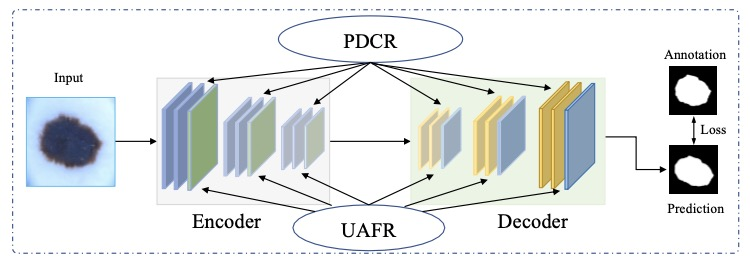
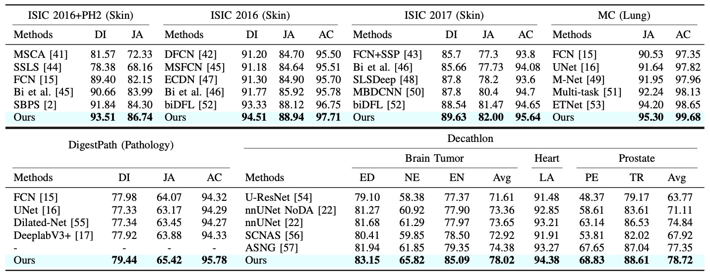
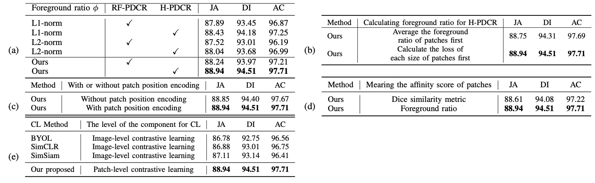
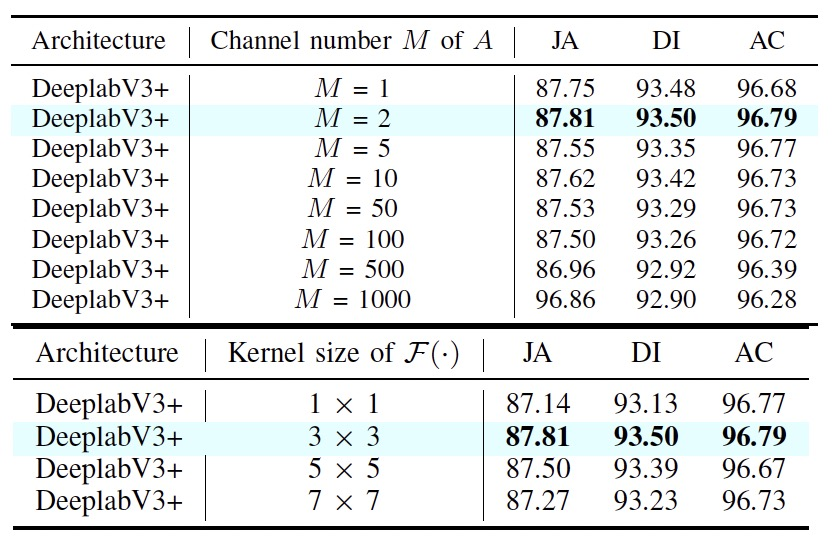
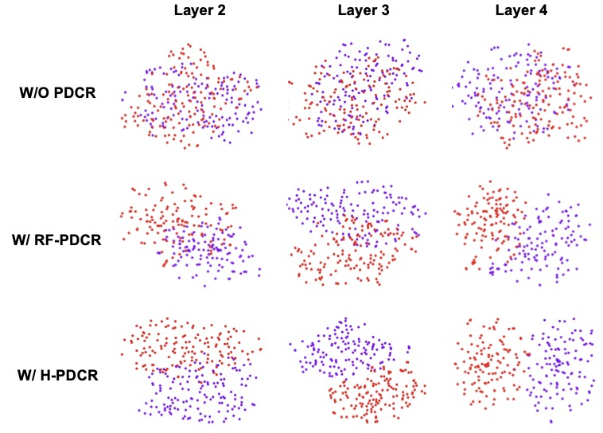
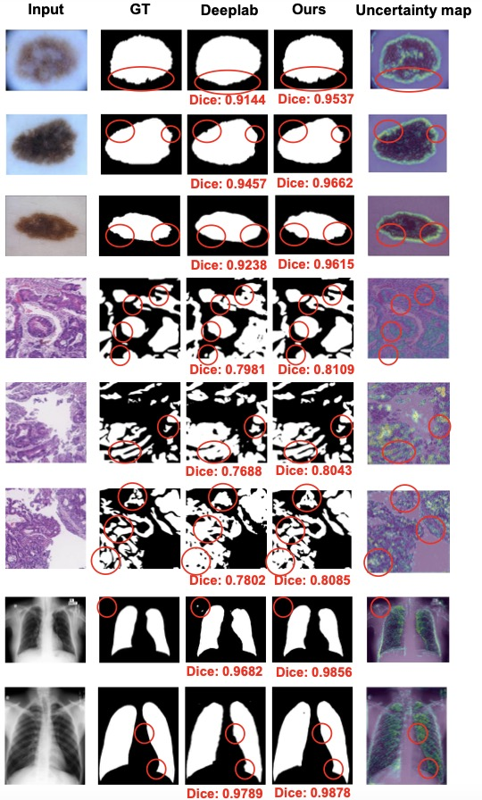

# Contrastive and Selective Hidden Embeddings for Medical Image Segmentation  

<!--- --->
Code for paper [Contrastive and Selective Hidden Embeddings for Medical Image Segmentation](https://arxiv.org/). 


> [Contrastive and Selective Hidden Embeddings for Medical Image Segmentation](https://arxiv.org/) \
> Authors: Zihao Liu, Zhuowei Li, Zhiqiang Hu, Qing Xia, Ruiqin Xiong, Shaoting Zhang* and Tingting Jiang* \

Contact: liuzihao@sensetime.com. Feel free to ask any questions or discussions!

<div align="center"></div>


## Abstract:

Medical image segmentation is fundamental and essential for the analysis of medical images. Although prevalent success has been achieved by convolutional neural networks (CNN), challenges are encountered in the domain of medical image analysis by two aspects: 1) lack of discriminative features to handle similar texture of distinct structures and 2) lack of selective features for potential blurred boundaries in medical images. In this paper, we extend the concept of contrastive learning (CL) to the segmentation task to learn more discriminative representation. Specifically, we propose a novel patch-dragsaw contrastive regularization (PDCR) to perform patch-level tugging and repulsing. In addition, a new structure, namely uncertaintyaware feature selection block (UAFS), is designed to address the potential high uncertainty regions in the feature maps and serves as a better feature selection. Our proposed method achieves state-of-the-art results across 8 public datasets from 6 domains. Besides, the method also demonstrates robustness in the limited-data scenario.


## Contribution: 

- A new formulation of “pair” is proposed to improve the contrastive learning for supervised medical image segmentation, including the component and the relationship of “pair”. On this basis, a novel Patch-dragsaw contrastive regularization (PDCR) is proposed to regularize patch-level relations by contrastive constraints, which is implemented by two ways: Receptive-Field-based PDCR and Hierarchical PDCR.

- Uncertainty-aware feature selection (UAFS) module is designed to avoid the learning-attention shift problem in  medical image segmentation, which is caused by minority features with high uncertainty due to the characteristics of medical images, and select a better feature.

- State-of-the-art results have been achieved across 8 diverse datasets from 6 domains. Furthermore, we substantiate the potential applicability of proposed methods under a limited data scenario by utilizing only 25% data to outperform the baseline methods with full data.


## Experiments


### Benchmark
- Performance of our proposed method against comparative methods over eight different benchmark datasets. 
<div align="center"></div>

### Ablation study for PDCR
- PDCR against other similar designs.
<div align="center"></div>

### Ablation study for UAFR
- UAFR against other similar designs .
<div align="center"></div>

### Visualization results for the proposed modules 

- For PDCR, we visualize the distribution for various classes. 
<div align="center"></div>

- For UAFR, we visualize the uncertainty map. 
<div align="center"></div>


## Usage: 
### 2D experiments:


#### Main requirements

  * **torch >= 1.1**
  * **torchvision >= 0.3**
  * **Python 3.6**
  * **16 NVIDIA GPUs**

#### Preparing Data
1. Download each dataset: 

  * **ISIC2016: https://challenge.isic-archive.com/data/**
  * **ISIC2017: https://challenge.isic-archive.com/data/**
  * **PH2: https://www.fc.up.pt/addi/ph2%20database.html**
  * **MC: https://www.kaggle.com/datasets/raddar/tuberculosis-chest-xrays-montgomery**
  * **DigestPath: https://digestpath2019.grand-challenge.org/**

2. Please organize each dataset as the following structure:

```
data
└── ISIC2016
    ├── train
    |   ├── img
            └── ISIC_0000000.jpg
            └── ISIC_0000001.jpg 
            └── ...
        ├── mask_jpg
            └── ISIC_0000000_Segmentation.jpg
            └── ISIC_0000001_Segmentation.jpg
            └── ...
    ├── test
    |   ├── img
            └── ISIC_0000003.jpg
            └── ISIC_0000012.jpg 
            └── ...
        ├── mask_jpg
            └── ISIC_0000003_Segmentation.jpg
            └── ISIC_0000012_Segmentation.jpg
            └── ...
└── ISIC2017
└── MC
...
```

#### Training

Run "run_training.py" for training (using the *.yaml* configuration files in `./configs/`).

Here is an example for ISIC2016 dataset: 
```   
# General setting
epochs: 300                                       # the number of epoch for training 
batch_size: 4                                     # batch size
num_workers: 4
syncbn: True
mc: True
seed: 666

# THe information of contrastive loss
# if adopt H-PDCR in encoder, decoder and cross-layer:
criterions: [['ce', 1], ['encoder_patchseries', 0.1], ['decoder_patchseries', 0.01], ['multi_layer_patchseries', 0.01]]                                                 
class_weight: [1, 1]           
loss_temperature: 1

# The information of model      
model:
    mode: 'DeepLab_bcl_att2'                      # DeeplabV3+
    input_channel: 3
    num_classes: 2                                # number of segmentation class
    backbone: 'xception_bcl_att2'                 # xception-net as encoder
    output_stride: 16   
    freeze_bn: False 

    # our method
    layer_sample: [128, 64, 32, 8, 8, 8, 8]       # sample number of vectors for each layer(N)
    loss_layerchoice: [1, 1, 1, 1, 1, 1, 1]       # whether adopt PDCR on this layer, 1 denotes adopt  

    distance_measure: 'cosine'                    # cosine similarity for each two vectors 
    fea_weight_choice: 'receptive_field'          
    sample_strategy: 'stride'
    bcl_layer_choice: [2,3]                       # which layer to adopt PDCR

    bcl_multi_layer_choice: [2,3]                 # for cross-layer, which layer to adopt PDCR 
    layer_sample_multilayer: [32, 32, 32, 32, 32] # for cross-layer, sample number of vectors for each layer(N)

    patchnumber: 3                                # the number of patches in the patch series of H-PDCR
    patchsize: [5, 7, 9]                          # the size of each patch 
    similarityfirst_encoder: True                 # calculate the similarity of each two patch first 
    similarityfirst_decoder: True                 # calculate the similarity of each two patch first   
    similarityfirst_multi: True                   # calculate the similarity of each two patch first 
    patchforeground_weight: [1.0, 1.0, 1.0]       # weight to calculate the loss for each size of patch

    uncertainty_att_layerchoice: [1,1,1,1,1,  0,0,0,0,0,  1,1]  # adopt UAFR in which layer 

# The information of dataset
dataset:
    mode: 'ISIC2016'
    root_path: './data/'
    input_size: [512, 512, 3]
    preload: False
    aug: True
    mean: [0.485, 0.456, 0.406]
    std: [0.229, 0.224, 0.225]
    modality: '2D'

# The information of data augmentation
data_aug:
    affine:
      scale: [0.8, 1.2]
      translate: [0.1, 0.1]
      rotate: [-90, 90]
      shear: [-20, 20]
    flip: [0.5, 0.5]

# The information of validation
test:
  rank_metric: ['mIoU']  
  metric_used: ['mDice', 'mIoU', 'Acc']  
  resize_option: 'resize_first'  
  resize_interpolation: 'bilinear'  
```

#### Testing

Similar with training, run "run_test.py" (using the *.yaml* configuration files in `./configs/`).


### 3D experiments:

For the training and testing of 3D experiments, please follow the instruction of nnUNet: https://github.com/MIC-DKFZ/nnUNet. 

Our proposed two modules (PDCR and UAFR) in nnUNet are in the following files:

PDCR: `./nnunet/training/loss_functions/deep_supervision.py/`

UAFR: `./nnunet/network_architecture/generic_UNet.py/`


# Citation

```
@article{CSMIS,
  title={Contrastive and Selective Hidden Embeddings for Medical Image Segmentation},
  author={Liu, Zihao and Li, Zhuowei and Hu, Zhiqiang and Xia, Qing and Xiong, Ruiqin and Zhang, Shaoting and Jiang, Tingting}, 
  journal={arXiv preprint},
  year={2022}
}
```

